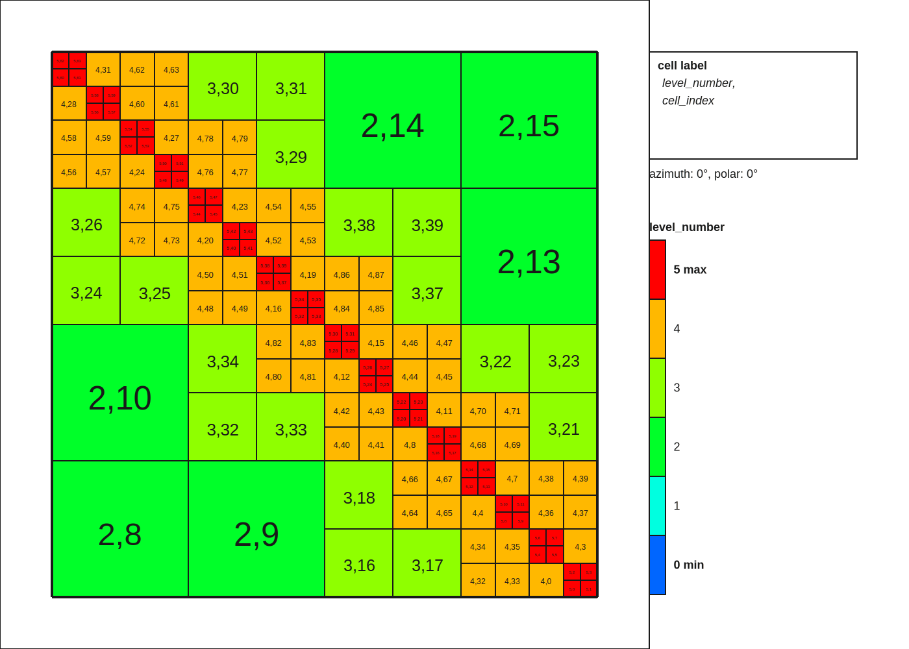
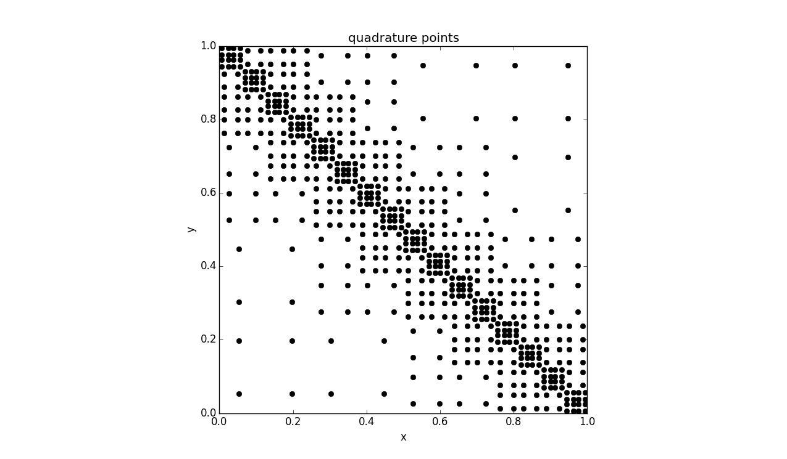
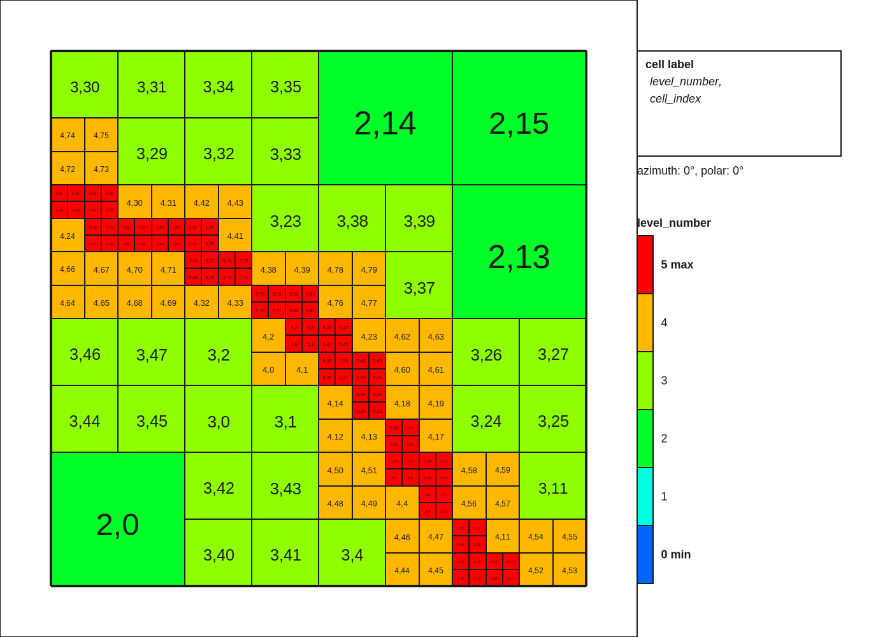
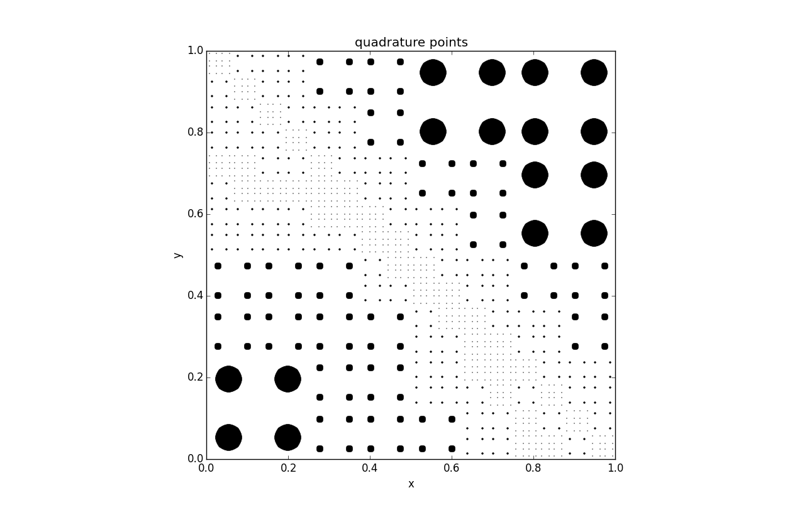
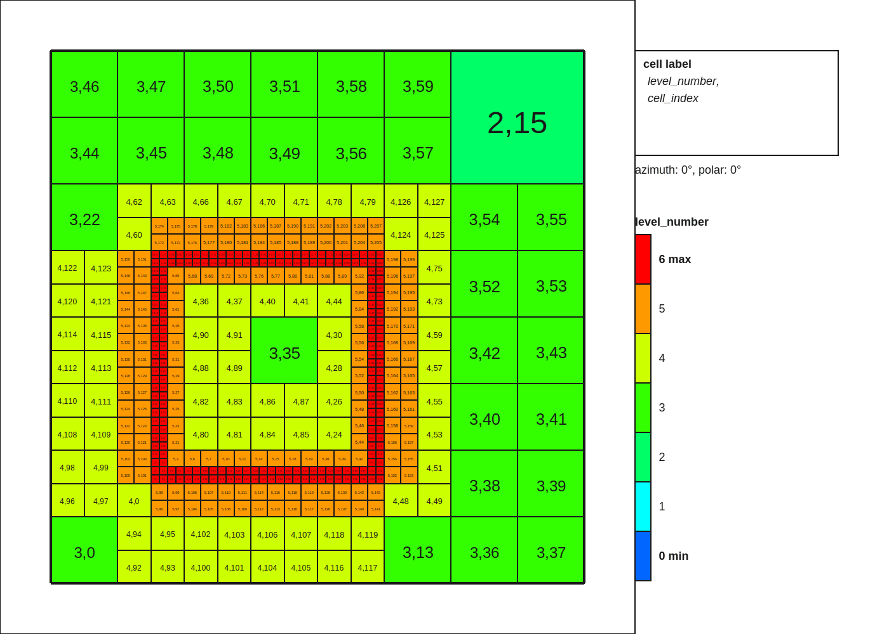
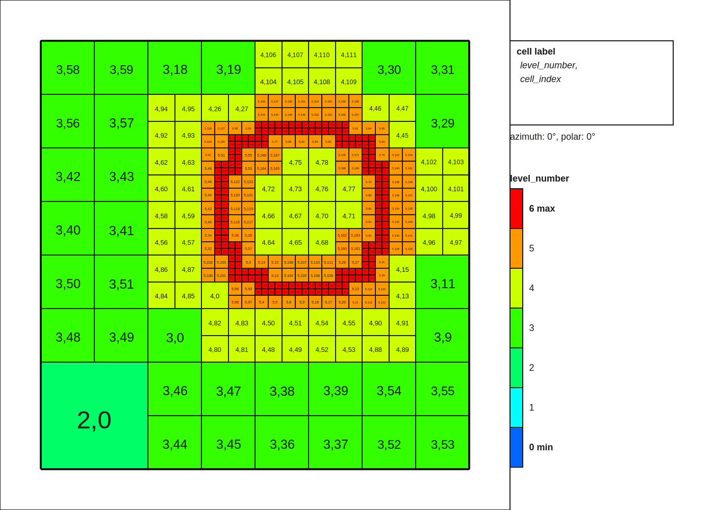
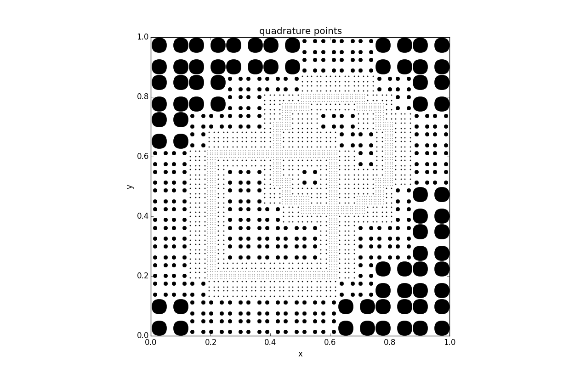

### Adaptive Quadrature Rules
Create a quadrature rule on a given cell, based on the refinement of this
cell in another triangulation.

### Examples
#### Diagonal
The grid to resolve the diagonal interface

The generated quadrature rule

#### Parabola
The grid to resolve the parabola interface

The generated quadrature rule

#### Diagonal and Parabola
Combined quadrature rule for Diagonal and Parabola interface (`test5()`)

#### Cube and circle
Grid for cube interface

Grid for circle interface

Combined quadrature rule for Cube and Circle interface (`test_values.cc`)

### Running
Make sure the environment variable `DEAL_II_DIR` contains the location of
`deal.II`, then

    mkdir build
    cd build
    cmake ..
    make qtest && ./multitria/qtest
    ./plot.sh deallog
